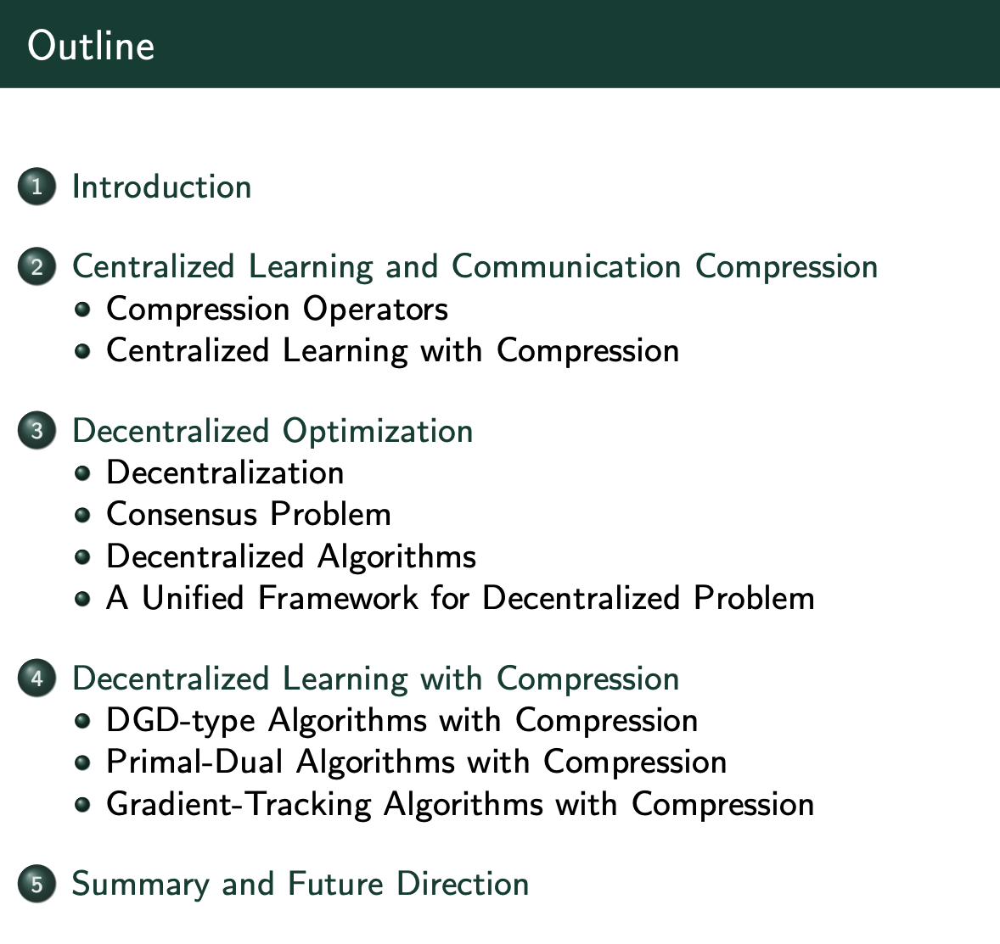

# Communication Efficient Distributed Learning

## Overview
The recent explosion in the sizes of machine learning models and datasets has led us to the contemporary big data era. With the increased availability of computational resources, distributed learning has become the cornerstone for the success of machine learning in numerous areas. However, the scaling of existing distributed learning system is dominantly restricted by the communication bottlenecks, especially when the communication network bandwidth is limited. Therefore, how to develop communication efficient distributed learning algorithms becomes the crux for building large-scale and efficient distributed learning systems.

In this tutorial, we provide a systematic introduction of communication efficient distributed learning and review frontier papers in this active research topic. Specifically, we mainly focus on two effective and popular strategies for improving the communication efficiency, i.e., communication compression and decentralization, as well as their combinations. We aim to provide a systematic lecture ranging from algorithm developments and theoretical properties to practical implementations. We expect this tutorial to disseminate the recent progresses in this research area and benefit the AI community.

## Presenter

- [Xiaorui Liu](http://cse.msu.edu/~xiaorui/) 
- [Yao Li](https://yaoleoli.github.io/)
- [Ming Yan](https://users.math.msu.edu/users/myan/)
- [Jiliang Tang](http://cse.msu.edu/~tangjili)

<!--  -->

   

## Date

Virtual from 10:00 am to 1:00 pm on August 20th, 2021 (EST)

## Outline 

<!--  -->

   

## Slide

[Download](http://cse.msu.edu/~xiaorui/files/IJCAI2021_OPT_Tutorial.pdf)

